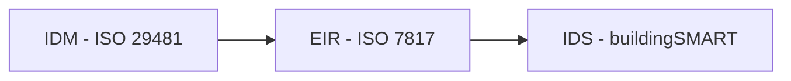

# Oficina de trabalho : Do UCM  ao IDS 

## Como elaborar requisitos de troca de informações a partir de casos de uso, utilizando IDM e IDS

### Objetivo
O objetivo desta oficina prática é praticar a elaboração de requisitos de troca de informação (EIR), sob a ótica da ISO 19650, utilizando a metodologia estabelecida na ISO 29481-1 (IDM). Além disso, vamos elaborar os EIRs no formato IDS - Information Delivery Specification - padrão aberto definido pela buildingSMART para especificação de requisitos de troca de informação.

### Dinâmica
Os participantes serão divididos em **4 grupos** de até **5 participantes**. Cada grupo terá que trazer ao menos **um notebook** para poder realizar as atividades. Serão utilizados softwares específicos que estão listados abaixo.

### Programação

A oficina será no dia XX de nov 2025 das 8:00h às 12:00h.

**1. Apresentação:** 
- 1.1. Objetivo
- 1.2. Metodologia
- 1.3. Principais Conceitos

**2. Elaboração do IDM:** 
- 2.1. Conceito de IDM ([ISO 29481-1:2016](https://www.iso.org/standard/60553.html))
- 2.2. Elaboração do mapa de processos
- 2.3. Documentação dos processos
- 2.4. Mapeamento das trocas de informações

**3. Elaboração do EIR:** 
- 3.1. Conceito de LOIN ([ISO 7817-1:2024](https://www.iso.org/standard/82914.html))
- 3.2. Documentação do EIR

**4. Elaboração do IDS:** 
- 4.1. Conceito de [IDS](https://www.buildingsmart.org/standards/bsi-standards/information-delivery-specification-ids/) (buildingSMART)
- 4.2. Criação do IDS

 

No final teremos produzidos os seguintes documentos:

 

### Softwares utilizados
Serão tilizadfos softwares específicos paraas atividades programadas. Todos são gratuitos, mas alguns precisam ser instalados no computador utilizado. São eles:

- ***Ferramentas online:*** 
	- Para a elaboração do mapa de processo será utilizada ferramenta online: [bpmn.io](https://demo.bpmn.io/). 
	
	- Para a elaboração do IDS será utilizado a plataforma online, aberta e gratuita [IFC Tester](https://ifctester.pages.dev/).
 

### Templates

Serão utilizados alguns templates para a descrição dos processos e do EIR que precisam ser baixados pelo link abaixo:

- Templates:
	- [EIR - Requisitos de Troca de Informações](https://github.com/c4rlosdias/Workshop_IDS/blob/main/templates/EIR.xlsx)
	- [IDM - Mapa de Processos](https://github.com/c4rlosdias/Workshop_IDS/blob/main/templates/IDM.xlsx)

### Apresentação

Faça download do material do workshop:

- [Material da oficina](https://github.com/c4rlosdias/Workshop_IDS/blob/main/Oficina.pdf)

